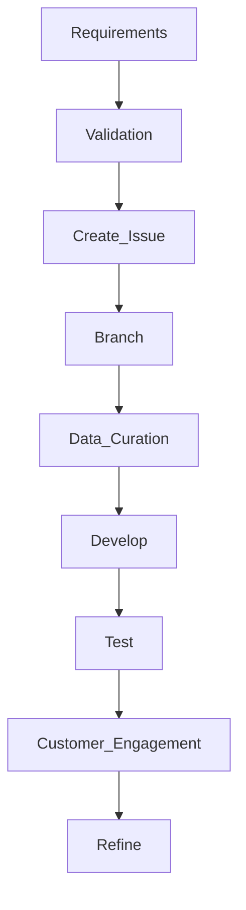

# GenerativeAi

## Description

Repository for all Artificial Intelligence (AI) projects within Foundational Digital Solutions (FDS) in support of the USDA/NRE as a whole.

##### Table of Contents
[Branches](#branches)

[Prerequisites](#prerequisites)

[Useage](#useage)

+ [Versioning](#versioning)
+ [Project Data](#proj_data)
+ [Coding Standards](#code_standards)
+ [Branching Standards](#branch_standards)
+ [Development Environment](#dev_environment)
+ [Data Standards](#data_process)
+ [External Dependencies](#docker)
+ [Deployment](#deployment)

[Folder Structure](#folder_structure)

[References](#references)


<a name="branches"/>

## Branches
Main branch is the primary branch for this project.  Note that in the future a develop branch will be created for developer submissions with integration into main by a senior developer.

<a name="prerequisites"/>

## Prerequisites / Knowledge

### System Requirements

#### Google Cloude Provider (GCP)

##### Library Requirements

```shell
pip install nvidia-cudnn-cu12==8.9.7.29
pip install tensorflow==2.17
pip install tensorrt
pip install spacy[cuda12x]
pip install torch torchvision torchaudio pycuda
```

**Expect to see a v2.4 for Torch.**

#### Microsoft Azure


<a name="useage"/>

## Useage instructions

<a name="versioning"/>

### Versioning

Various versioning is present in this repository as each task is independent of others.  Typical versioning follows [Sementic Versioning 2.0.0] (https://semver.org/).

Given a version number MAJOR.MINOR.PATCH, increment the:

+ *MAJOR* version when you make incompatible API changes
+ *MINOR* version when you add functionality in a backward compatible manner
+ *PATCH* version when you make backward compatible bug fixes

Additional labels for pre-release and build metadata are available as extensions to the MAJOR.MINOR.PATCH or MAJOR-MINOR-PATCH, in support of directory structures, format.

<a name="proj_data"/>

### Critical Project Data

+ All Authoritative data is kept in:
  + gs://usfs-gcp-rand-test3-data-usc1
+ Authoritative folders have the following structure:
  + ```public_source``` - immutable data used for experiments and labs.
  + ```source_data``` - Input used for actual Use Case development, versioning applies to code.
  + ```working_data``` - Output generated from code, versioning applies to code. 


<a name="code_standards"/>

### Coding Standards

#### Development instructions


<a name="branch_standards"/>

#### Branch instructions

+ Create branches via the GitHub Issue the work is related to and then delete them when the ticket is closed.
  + Do not allow too many branches, making it impossible for a new developer to know where to start
+ Create annotated tags when a version of your code is released.
+ Use formatting tools and lint your code for that issue on the files you worked on (not the entire code base, we don't want to trigger mass change).
+ DO NOT include data or binary files (unless a code artifact) to the repository.
+ Add testing when/where appropriate (Jupyter Notebooks are not necessarily applicable here).
+ Each tag inspect the README.dm to ensure we're not out of date or simply innacurate README exists

Coding standards are, by their very nature, opinionated, and the following represents my own opinion, based on decades of professional software development, of what our common coding standards ought to be. These standards are mostly independent of programming language (I've included some language specific recommendations as well however) and present a 'best-practice' approach to developing high quality software.

#### Repository Structure
For any codebase there will be a repository, known as the 'upstream' repository.

The benefits of enforcing this are as follows:

+ When a new developer joins the project it's easy for them to see immediately which branch contains the latest work in progress and which branch contains the latest release code.
+ For public facing repositories it presents a clean and consistent public face for our codebase, showing us in the best possible light.
+ Each developer can use their own fork to do whatever work they need to, and the onus is on them to keep their own repositories tidy.

+ ***The Upstream Repository will only have two branches, develop, containing the latest working code, and main containing the current release.***

***The default branch will be develop***

***The develop and master branches are locked down such that the only way code can be contributed to them is via a peer-reviewed pull-request.***

Over and above the default labels provided by GitHub add documentation and feature labels.

Assign teams admins with admin rights, and developers with write access to the repo.

#### Workflow

+ Developers should not, as a general rule be working in other developer's branches, but if it's really needed they can by setting up another git remote
+ Ensure work conforms to common linting standards (For Javascript projects I use eslint and prettier for this, but tools vary from language to language)
+ Ensure work is consistent with current documentation
+ Assign reviewers, appropriate labels, and assign the PR to yourself
+ Using GitHub to create a Pull Request against the upstream develop branch (see below for ticket naming scheme)
+ Respond to any review comments / make changes as appropriate.
+ When all changes / ticket is approved, merge the PR and delete the branch

Features must be named per the following pattern #{issue number}/{some_descriptive-text} — so for example, if you are working on issue ABC-1 with the title "do the thing", call your feature ABC-1/do_the-thing. Obviously use your common sense to avoid making the feature names too long.

#### Commit Messages
When committing something use the -m flag to add a short commit message of the format {issue number} summary of what you changed. So for example if you are working on issue ABC-1 and you added a method to the aardvark_controller you might use the following commit message "ABC-1 added anteater method to aardvark controller".

Commit messages ought to be in the past tense.

In general try to group file changes wherever appropriate, so if your controller change also involved updating something in a helper file, the one commit message can happily encompas the changes to both files. The message ought to reflect the main aim of the change.

+ Bug Fix - the change fixes a bug
+ Feature - the change adds a new feature (the usual issue type)
+ Documentation — The change is a documentation only change
+ Optimisation - The change is an optimisation of the code base without any functional changes

If your change does not fit any of these categories, use Feature. Likewise if your change is not tied to an issue number you may use n/a instead.

So to use the *above example your commit would have the following message*:

```#<Issue Id> Feature added cosine similarity to human selected comments versus generative selected comments.```

<a name="deployment"/>

#### Deployment instructions


<a name="docker"/>

#### Use Docker for external dependencies

For code that requires external dependencies such as Mongo, Redis, Postgres, etc, ensure there is a docker-compose.yml file configured to run those dependencies. Do not assume that a developer has Mongo etc already installed. If the developer is a contractor with multiple clients it's often difficult or impossible for them to run such things on their bare metal.

<a name="dev_environment"/>

#### Development Environment

***???***

<a name="data_process"/>

#### Data Process

***???***

<a name="folder_structure"/>

## Folder structure

Documentation folder has 3 level tree-like structure, inspired by ZenDesk documentation structure:

```
./
├── .devcontainer/ (potential for CodeSpaces)
│   ├── Dockerfile
│   ├── devcontainer.json
├── .gitignore
├── README.md
├── ML-Support/
│   ├── cfg (sample *nix configuration file)
│   ├── environment (environment files for Anaconda setups)
│   ├── script (scripts to run them all for Git repos, templates)
│   ├── README.md
│   ├── *.py
│   ├── *.rc (screen configuration file examples)
│   ├── debug.py (standard logging library)
│   ├── MOAM.py
│   ├── test_MOAM.py
│   ├── test_MOAM_documentation.md
│   └── another_article/
└── ML-<Issue Id, 3 digits>_<Short Name>/
    └── *
├── shared/
│   ├── Various scripts like gcs fuse mounting.
```
<a name="references"/>

## Reference

+ [Nate populate this] (https://www.google.com)
