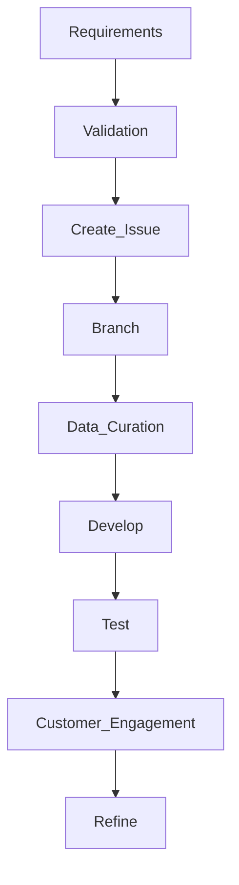

# GenerativeAi

## Description

Repository for all Artificial Intelligence (AI) projects within Foundational Digital Solutions (FDS) in support of the USDA/NRE as a whole.

##### Table of Contents
[Branches](#branches)

[Prerequisites](#prerequisites)

[Useage](#useage)

+ [Versioning](#versioning)
+ [Project Data](#proj_data)
+ [Coding Standards](#code_standards)
+ [Branching Standards](#branch_standards)
+ [Development Environment](#dev_environment)
+ [Data Standards](#data_process)
+ [External Dependencies](#docker)
+ [Deployment](#deployment)

[Folder Structure](#folder_structure)

[USDA NRE Compliance](#usda_new_compliance)

[References](#references)

<a name="branches"/>

## Branches
Main branch is the primary branch for this project.  Note that in the future a develop branch will be created for developer submissions with integration into main by a senior developer.

<a name="prerequisites"/>

## Prerequisites / Knowledge

### System Requirements

#### Google Cloude Provider (GCP)

##### Library Requirements

```shell
pip install nvidia-cudnn-cu12==8.9.7.29
pip install tensorflow==2.17
pip install tensorrt
pip install spacy[cuda12x]
pip install torch torchvision torchaudio pycuda
```

**Expect to see a v2.4 for Torch.**

#### Microsoft Azure


<a name="useage"/>

## Useage instructions

<a name="versioning"/>

### Versioning

Various versioning is present in this repository as each task is independent of others.  Typical versioning follows [Sementic Versioning 2.0.0] (https://semver.org/).

Given a version number MAJOR.MINOR.PATCH, increment the:

+ **MAJOR** version when you make incompatible API changes
+ **MINOR** version when you add functionality in a backward compatible manner
+ **PATCH** version when you make backward compatible bug fixes

Additional labels for pre-release and build metadata are available as extensions to the MAJOR.MINOR.PATCH or MAJOR-MINOR-PATCH, in support of directory structures, format.

<a name="proj_data"/>

### Critical Project Data

+ All Authoritative data is kept in:
  + ```gs://usfs-gcp-rand-test3-data-usc1```
+ Authoritative folders have the following structure:
  + ```public_source``` - immutable data used for experiments and labs.
  + ```source_data``` - Input used for actual Use Case development, versioning applies to code.
  + ```working_data``` - Output generated from code, versioning applies to code. 


<a name="code_standards"/>

### Coding Standards

#### Development instructions


<a name="branch_standards"/>

#### Branch instructions

+ Create branches via the GitHub Issue the work is related to and then delete them when the ticket is closed.
  + Do not allow too many branches, making it impossible for a new developer to know where to start
+ Create annotated tags when a version of your code is released.
+ Use formatting tools and lint your code for that issue on the files you worked on (not the entire code base, we don't want to trigger mass change).
+ DO NOT include data or binary files (unless a code artifact) to the repository.
+ Add testing when/where appropriate (Jupyter Notebooks are not necessarily applicable here).
+ Each tag inspect the README.dm to ensure we're not out of date or simply innacurate README exists

Coding standards are, by their very nature, opinionated, and the following represents my own opinion, based on decades of professional software development, of what our common coding standards ought to be. These standards are mostly independent of programming language (I've included some language specific recommendations as well however) and present a 'best-practice' approach to developing high quality software.

#### Repository Structure
For any codebase there will be a repository, known as the 'upstream' repository.

The benefits of enforcing this are as follows:

+ When a new developer joins the project it's easy for them to see immediately which branch contains the latest work in progress and which branch contains the latest release code.
+ For public facing repositories it presents a clean and consistent public face for our codebase, showing us in the best possible light.
+ Each developer can use their own fork to do whatever work they need to, and the onus is on them to keep their own repositories tidy.

Over and above the default labels provided by GitHub add documentation and feature labels.

Assign teams admins with admin rights, and developers with write access to the repo.

#### Workflow

+ Developers should not, as a general rule be working in other developer's branches, but if it's really needed they can by setting up another git remote
+ Ensure work conforms to common linting standards (For Javascript projects I use eslint and prettier for this, but tools vary from language to language)
+ Ensure work is consistent with current documentation
+ Assign reviewers, appropriate labels, and assign the PR to yourself
+ Using GitHub to create a Pull Request against the upstream develop branch (see below for ticket naming scheme)
+ Respond to any review comments / make changes as appropriate.
+ When all changes / ticket is approved, merge the PR and delete the branch

Features must be named per the following pattern #{issue number}/{some_descriptive-text} — so for example, if you are working on issue ABC-1 with the title "do the thing", call your feature ABC-1/do_the-thing. Obviously use your common sense to avoid making the feature names too long.

#### Commit Messages
When committing something use the -m flag to add a short commit message of the format:

```#<Issue_Id by Ticketing System><Optional:(Use Case Id)><Bug Fix|Feature|Documentation|Optimization><Short description of the change in past tense>.```

*the pound system is required*

Commit messages ought to be in the past tense.

In general try to group file changes wherever appropriate, so if your controller change also involved updating something in a helper file, the one commit message can happily encompas the changes to both files. The message ought to reflect the main aim of the change.

+ Bug Fix - the change fixes a bug
+ Feature - the change adds a new feature (the usual issue type)
+ Documentation — The change is a documentation only change
+ Optimisation - The change is an optimisation of the code base without any functional changes

If your change does not fit any of these categories, use Feature. Likewise if your change is not tied to an issue number you may use n/a instead.

So to use the *above example your commit would have the following message*:

+ ```#132 Feature added cosine similarity to human selected comments versus generative selected comments.```
+ ```#132 (ML-025) Feature added cosine similarity to human selected comments versus generative selected comments.```

<a name="deployment"/>

#### Deployment instructions

Not applicable to this repository, these are experimental projects.  If a project graduates to operational a dedicated repository will be made for it.

<a name="docker"/>

#### Use Docker for external dependencies

For code that requires external dependencies such as Mongo, Redis, Postgres, etc, ensure there is a docker-compose.yml file configured to run those dependencies. Do not assume that a developer has Mongo etc already installed. If the developer is a contractor with multiple clients it's often difficult or impossible for them to run such things on their bare metal.

<a name="dev_environment"/>

#### Development Environment

***???***

<a name="data_process"/>

#### Data Process

Utilize the following tenants when maturing your data source:

+  **Authoritative**

 + There's only one place to get it.
 + That data represents the place to get the data and the only place.

+  **Versioned**

 + Meaning it's known, embedded with the output.
 + It's correlated with the code used to create it.

+  **Easily read**

 + In AI/ML, single dimensional arrays dominate all.
 + Binary output is secondary best.
 + Easily understood and reentrant is likely your best bet.
 + If possible take a well-known data structure and pickle it.  Easily read, easily understood and quickly reentrant.  Pandas -> Pickle.

+  **Easily accessed**
 + You don't have to "hunt" for it.
 + Access control is applied.
 + Easily searched for in a central portal with descriptions of meta-data, links for download and previews of the content.

+  **Cleansed**
 + Prompt Injection checked (NLP methods, existing AI neural layers).
 + PII cleansed (Named Entity Recognition [NER] methods), DLP, and regular expressions.
 + CUI cleansed
 + Original data maintained and immutable.
 + Cleaned data (at whatever level) documented and saved as an additional set of data

+  **Peer Reviewed**
 + Data Scientist reviewed in terms of cleansing and preparatory work.

+  **Documented**
 + See all the aforementioned information and co-locate that data in one place that's consistently formatted and easily read/discoverable (ERDDAP?)

<a name="folder_structure"/>

## Folder structure

Documentation folder has 3 level tree-like structure, inspired by ZenDesk documentation structure:

```
./
├── .devcontainer/
│   ├── Dockerfile
│   ├── devcontainer.json
├── .env
├── .env_ai
├── .env_api_keys
├── .env_cloud
├── README.md
├── ML-Support/
│   ├── cfg 
│   ├── environment 
│   ├── script
│   ├── README.md
│   ├── *.py
│   ├── *.rc 
│   ├── debug.py
│   ├── MOAM.py
│   ├── test_MOAM.py
│   ├── test_MOAM_documentation.md
│   └── another_article/
└── ML-<Issue Id, 3 digits>_<Short Name>/
    └── .env_app
    └── *
├── shared/
│   ├── Various scripts like gcs fuse mounting.
```
File/Folder Explanations:
+ .devcontainer - potential for CodeSpaces within GitHub.

+ .env* - files that support Pythonic projects for environment file loaded (configuration setup).

+  ML-Support/environment - Environment specification for standard Anaconda setups.

+  ML-Support/script - Examples/template for GitHub's One Script to Rule them All.

+  ML-Support/*.rc - Templates for Unix screen commands.

+  ML-Support/debug.py - Standard logging library.


<a name="references"/>

## USDA NRE Compliance

### General Standards

+ **Governance and Business Case**:
  +  Use Case management occurs within the AI Council.
  +  Business Owner engagement is required for active Use Cases.
  +  Registration with the USDA AI Inventory is required.

+ **Security**:
  +  Development environment needs to be in an ATO approved location with cognizance of the system owner.  
  +  Changes to the development environment must be approved via ticket to the system owner. 
  +  ***Discuss DLP***

+ **Product Owner (business responsibility)**:
  +  Business Owner engagement form recognized the end-user/customer. 
  +  The AI PM will act as a Product Owner for end-user/customers.
  +  Agile Scrum methodology will be used for prioritization and task management conducted by the USDA NRE AI Project Management.

+ **Technical Owner (CIO)**:
  +  The Technical Owner of an AI engagement is recognized as the USDA NRE AI Technical Lead.

+ **Authoritative**: 
  +  Analysis by the AI Council will help determine the priority, impact, and the potential for overlapping business functions.
  + The Architecture Review Board (ARB) will determine final disposition of an AI project targeted for operational deployme nt.

+ **Hosting**:
  +  AI solutions will be hosted in Azure or GCP with system owner cognizance and coordination.

+ **Environment**:
  +  Any solution targeted for operational release will have their own repositories and pick up with the standard CTO engagement process once approved by the AI Council.

## Accessibility & Design Standards

All technical solutions and development efforts must meet the following accessibility and design standards:

+ **Accessibility**: 
    + Section 508 compliance is difficult to achieve due to the nature of certain Python libraries, however efforts are being made to provide *alt* text inputs and comments that work with JAWS screen readers.
    + Note that operational capabilities are expected to be compliant if a web presence is established.
+ **Consistency**:
    +  Power BI is used to present data in most Use Cases with collaboration with the end-user.

+ **Mobile friendly**: Technical Solutions must be usable and function on mobile devices.
    + Not applicable for current exploratory efforts.

+ **Searchable**: 
    + Not applicable unless a solution is developed for operational release.  Most of these efforts are Jupyter Notebook runs resulting in a data file which is presented / reviewed via Power BI.

+ **User-centered**:
    +  Power BI is utilized with end-user collaboration for output files.

+ **U.S. Web Design System**: 
    + Not applicable.

## Technical Standards

All technical solutions and development efforts must meet the following technical standards:

+ **Solution Architecture**:
  + Architecture Review Board (ARB) would approve a solution is graduation into the CTO Demand Intake process authorized forward progression to Operations.

+ **Source Code Management**: 
  + See this repository.

+ **Main Branch Management**:
  + A main branch exists with a defined Branch.

+ **Technology Stacks**:
  + Technology stack is investigated during the Prototyping process.  Final approval of the solution would require ARB approval.

+ **Continuous Integration and Compliance Validation**:
  +  Note that these Prototypes are exploratory in nature and not valid candidates for CI/CD efforts.

+ **Standard Configuration**:
  +  Not applicable as these are proofs of concept / prototypes and not for operational use.

+ **Continuous Deployment and Release Management**:
  +  Not applicable.

+ **Minify**:
  + Not applicable.

+ **JAVA Development**: 
  + Not applicable.

+ **Employ Continuous Monitoring and Alerting**:
  + Not applciable, not operationally released, different process.

<a name="references"/>

## Reference

+ [USDA NRE Application Standards](https://fsweb.wo.fs.fed.us/ad/)
+ [21st Century IDEA ACT](https://digital.gov/resources/21st-century-integrated-digital-experience-act/?utm_source=listserv-allcop&utm_medium=email&utm_campaign=web-standards-2020-01-23)
+ [Section 508](https://digital.gov/resources/21st-century-integrated-digital-experience-act/?utm_source=listserv-allcop&utm_medium=email&utm_campaign=web-standards-2020-01-23)
+ [M-13-13 Open Data Policy](https://digital.gov/resources/21st-century-integrated-digital-experience-act/?utm_source=listserv-allcop&utm_medium=email&utm_campaign=web-standards-2020-01-23)
+ [M-15-14 Management and Oversight of Federal Information Technology](https://policy.cio.gov/fitara/)
+ [Federal Information Technology Acquisition Reform Act (FITARA)](https://www.congress.gov/113/plaws/publ291/PLAW-113publ291.pdf#page=148)
+ [M-16-21 Federal Source Code Policy](https://policy.cio.gov/source-code/)
+ [Data Center Optimization Initiative](https://policy.cio.gov/dcoi/)
+ [Guidelines for PIV enablement](http://www.cac.mil/Portals/53/Documents/m-11-11.pdf?ver=2017-04-17-081020-897)
+ [HTTPS-only Standard](https://www.whitehouse.gov/sites/whitehouse.gov/files/omb/memoranda/2015/m-15-13.pdf)
+ [NIST FIPS-199](http://nvlpubs.nist.gov/nistpubs/FIPS/NIST.FIPS.199.pdf)
